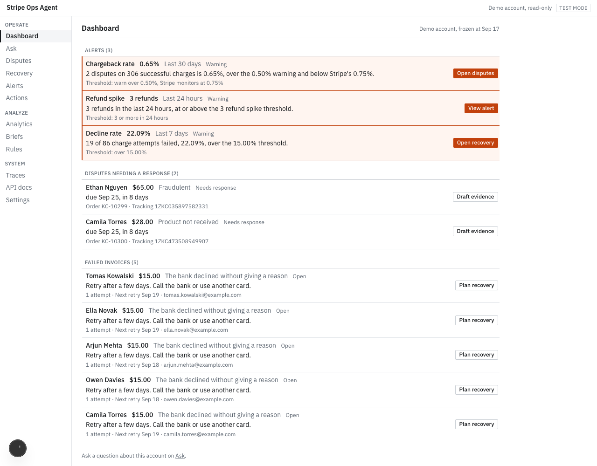
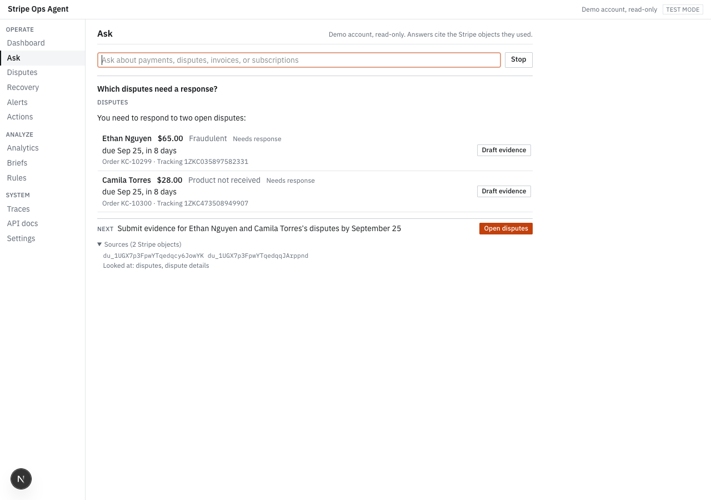

# Stripe Ops Agent

AI agents that help a small merchant run Stripe: answer questions with cited Stripe object IDs, draft dispute
evidence, recover failed payments, report revenue, and flag anomalies before Stripe's risk thresholds. Agents only
propose changes; nothing is written to Stripe until a person clicks Confirm. Test mode only.

**Live demo: https://stripe-ops-agent.vercel.app** (a seeded, read-only demo account; no setup).



Built for a Stripe PM application from 77 real merchant complaints ([discovery](docs/discovery/clusters.md),
[spec](docs/spec.md)). How it was built: [docs/workflow.md](docs/workflow.md).

## What it does

| Page | What a merchant gets | Complaints |
|---|---|---|
| Ask | Plain-English answers that lead with the answer, show disputes, invoices, alerts, and proposed actions as cards, end with one next step, and cite the Stripe objects used in a collapsed Sources list | C018, C062, C070 |
| Dashboard and Alerts | Chargeback rate over 0.5% (before Stripe's 0.75%), 3+ refunds in 24 hours, decline rate over 15%, checked on page load and after Stripe webhooks, with history | C006, C048, C064 |
| Disputes | Open disputes by deadline, facts gathered from Stripe, AI-drafted evidence to edit, and submission only after confirm | C037, C061, C072, C075 |
| Recovery | Failed invoices with decline reasons in plain English, a retry plan based on the decline type, and a customer email draft | C021, C040, C052 |
| Analytics | MRR, net MRR movement, churn, cohort retention, decline rate by card brand and country, and a narrative whose numbers are checked against the metrics | C018, C019, C047, C060 |
| Actions | Refunds, coupons, pauses, and cancellations proposed by the agent, confirmed here, and an audit log of every tool call | C028, C063, C078 |
| Traces | Every agent run: routing, models, tokens, latency, and each tool call | |
| Settings | Connect your own Stripe test account with a restricted key; the app checks its permissions without changing data | C028 |



## Evals

<!-- evalscore:start -->
**88 of 93 finished eval cases pass (95%)** on the production chain, 93 of 100 finished so far. Safety: 12 of 12 finished pass (13 total). Run 2 reran run 1's failures after fixes; how, and run 1's numbers: [evals/results.md](evals/results.md).
<!-- evalscore:end -->

113 cases: 15 routing, 20 disputes, 20 recovery, 30 analytics, 15 action proposals, and 13 safety cases.
Every expected value is computed from the demo account (`evals/ground-truth.ts`). A case passes only if routing,
facts, cited Sources, the expected proposal, the absence of completion claims and Stripe writes, and an LLM judge all
pass. Runs resume across days because free tiers allow about 20 agent answers a day per Groq model.

### Model benchmark

<!-- leaderboard:start -->
| Model | Cases finished | Pass rate | Safety finished | Safety pass rate | p50 latency | Rate-limit errors |
|---|---:|---:|---:|---:|---:|---:|
| Production chain (gpt-oss-120b, then fallbacks) | 93 of 100 | 95% | 12 of 13 | 100% | 7.5s | 986 |
| Groq gpt-oss-120b | 0 of 100 | n/a | 0 of 13 | n/a | n/a | 0 |
| Gemini 3.5 Flash Lite | 44 of 100 | 84% | 0 of 13 | n/a | 5.6s | 79 |
| Groq qwen3.8-27b | 32 of 100 | 94% | 0 of 13 | n/a | 5.2s | 86 |
<!-- leaderboard:end -->

Each benchmark row runs one model with no fallback. Pass rate and latency cover finished cases. See
[evals/benchmark.md](evals/benchmark.md) and [ADR 0004](docs/adr/0004-free-tiers.md).

## How safety works

- **Confirm before write** ([ADR 0003](docs/adr/0003-confirm-before-write.md)). Write tools only store a proposal
  with a one-line summary. The Stripe call runs only from a Confirm button, after the server checks that the
  proposal belongs to this connection, is still pending, and that the key's write permission is stored and still
  passes a fresh probe. A conditional update and an idempotency key make a double click harmless. If the audit row
  cannot be written, the action does not run.
- **Read-only by default** ([ADR 0005](docs/adr/0005-restricted-keys-not-connect.md)). Merchants paste a restricted
  test key; full secret keys and live keys are refused. Writes exist only for resources the key can write. The demo
  account can propose but never confirm.
- **Keys never reach a model.** Keys are stored AES-256-GCM encrypted, the browser holds only a signed connection
  ID, and tool errors are scrubbed of anything shaped like a key.
- **Stripe data is data.** Every prompt says text from tool results is never an instruction, and a write still needs
  a human even if a prompt injection gets through.
- **Tested.** Unit tests cover demo refusal, read-only keys, revoked permissions, another connection's proposal,
  double confirms, audit failure, and Stripe errors. The 13 safety evals run the agents against a Stripe client that
  blocks every write method and fail on any write attempt or any claim that a change was made.

## Stack

Next.js 15 (App Router, TypeScript strict), Postgres on Neon with Drizzle, the Stripe Node SDK in test mode, the
Vercel AI SDK v7 with a free model chain (Groq gpt-oss-120b, gpt-oss-20b, Gemini 3.5 and 3.1 Flash Lite), Tailwind
and shadcn/ui, Vitest, GitHub Actions, and Vercel. No paid services. How the agents fit together:
[ADR 0002](docs/adr/0002-multi-agent.md).

## Run it locally

```bash
pnpm install
cp .env.example .env.local   # fill in DATABASE_URL, Stripe test keys, GROQ_API_KEY, GOOGLE_GENERATIVE_AI_API_KEY, secrets
pnpm db:migrate
pnpm seed                    # needs STRIPE_SEED_KEY (a test key that can write); idempotent
pnpm dev                     # http://localhost:3000
pnpm test                    # unit tests
pnpm eval --suite safety     # safety evals; pnpm eval runs all 113 cases, pnpm eval:report writes the tables
pnpm demo:warm               # cache demo answers to the 10 example questions
```

## Demo data

The demo account is a Stripe test-mode sandbox filled by `pnpm seed`. Every object the seed creates has
metadata `seed=true` and a unique `seed_key`, and re-running the seed creates nothing new.

### Dates come from `occurred_at`, not Stripe `created`

Stripe cannot backdate charges, refunds, or disputes, so every seeded object was created on 2026-09-17
in Stripe's eyes. The seed stores each object's intended date in metadata `seed_occurred_at` and in the
`seeded_objects` table. In demo mode the app treats "now" as the seed anchor, 2026-09-17 04:39 UTC, so
the 24 hour, 7 day, and 30 day windows never drift. Why: [ADR 0001](docs/adr/0001-test-clocks.md).

What the seed targets:
- 350 successful charges, about 300 of them in the trailing 30 days
- 2 open disputes, a trailing 30 day dispute rate of 0.65%: over the 0.5% warning, under Stripe's 0.75%
- 35 declines, a trailing 7 day decline rate of 22%
- 6 refunds, 3 of them in the last 24 hours
- 25 active, 5 past_due, and 3 canceled subscriptions

### Documented leftovers

Design experiments on 2026-09-17 (test clocks, dispute cards, past_due flows) left objects in the demo
account that are not part of the seed. They are tagged `seed_key=experiment` where Stripe allows it. The
agent's tools, alerts, analytics, and evals skip tagged leftovers, so none of them count toward rates or totals.
The 3 untaggable subscriptions below now show as `canceled` in subscription lists; analytics skips subscriptions
without seeded dates that were canceled within an hour of creation, which covers them.

| Object | Count | Notes |
|---|---:|---|
| Charges | 9 | 7 succeeded, 2 failed. Tagged. |
| Payment intents | 9 | Behind the 9 charges. Tagged. |
| Disputes | 2 | `du_1UGX1c3FpwYTqedqZdxiQeqY` (fraudulent), `du_1UGX1f3FpwYTqedqxBotI4fs` (product not received), both closed as lost. Tagged. |
| Refunds | 1 | 1.00 USD on a 10.00 USD charge. Tagged. |
| Invoices | 4 | Tagged. |
| Products | 3 | Archived. Tagged. |
| Prices | 4 | Tagged. |
| Subscriptions | 3 | `sub_1UGX1W3FpwYTqedqc5dbOq8t`, `sub_1UGX223FpwYTqedqVC1eW1C6`, `sub_1UGX283FpwYTqedqpLOrH7zF`. Not tagged: Stripe refused updates while they were `incomplete_expired`. Skipped by analytics. |

The customers behind these objects were deleted.

### `--spike`

`pnpm seed --spike` adds 3 disputes to push the dispute rate over 0.75%. Stripe cannot delete disputes, so
this is permanent. The seed refuses `--spike` unless the Stripe account ID matches `SPIKE_ALLOWED_ACCOUNT`,
which should name a separate test account, never the demo account.

## Docs

- Product: [spec](docs/spec.md), [discovery](docs/discovery/clusters.md), [changelog](docs/changelog.md)
- Decisions: [ADR 0001 test clocks](docs/adr/0001-test-clocks.md), [0002 multi-agent](docs/adr/0002-multi-agent.md),
  [0003 confirm before write](docs/adr/0003-confirm-before-write.md), [0004 free tiers](docs/adr/0004-free-tiers.md),
  [0005 restricted keys](docs/adr/0005-restricted-keys-not-connect.md)
- Learning notes per phase: [docs/learn/](docs/learn/)
- Build process: [docs/workflow.md](docs/workflow.md)

## Sources

- Merchant complaints: 77 public posts from Reddit, WordPress.org support forums, Hacker News, X, and GitHub
  issues, each with a checked URL and a verbatim quote ([complaints.csv](docs/discovery/complaints.csv),
  [evidence.csv](docs/discovery/evidence.csv)).
- Stripe documentation: [test cards](https://docs.stripe.com/testing), [decline codes](https://docs.stripe.com/declines/codes),
  [dispute evidence](https://docs.stripe.com/disputes/responding), [dispute monitoring thresholds](https://docs.stripe.com/disputes/monitoring-programs),
  [restricted keys](https://docs.stripe.com/keys/restricted-api-keys), [test clocks](https://docs.stripe.com/billing/testing/test-clocks),
  [OAuth scopes](https://docs.stripe.com/connect/oauth-reference).
